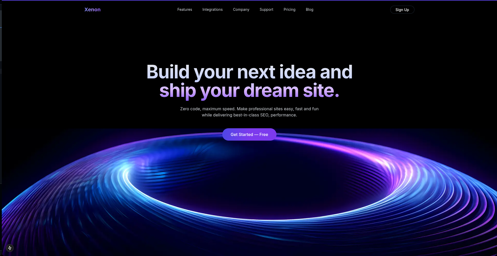

# Xenon - Stunning Landing Page

  
_A preview of the Xenon landing page_

Xenon is a beautifully designed static landing page, crafted for modern aesthetics. It features a sleek UI, eye-catching animations, and a seamless user experience.

## 🔧 Installation

If you're developing Xenon locally, follow these steps:

```bash
# Clone the repository
git clone https://github.com/Suryansh777777/Xenon.git

# Navigate to the project directory
cd Xenon

# Install dependencies
npm install

# Start the development server
npm run dev
```

## 🎨 Tech Stack

- **Frontend**: Next.js, Tailwind CSS
- **Backend**: Node.js, Express
- **Database**: PostgreSQL
- **Hosting**: Vercel

## 📬 Support

For any issues, feel free to open an issue on the [GitHub repository](https://github.com/Suryansh777777/Xenon).

## 📜 License

This project is licensed under the MIT License - see the [LICENSE](LICENSE) file for details.
